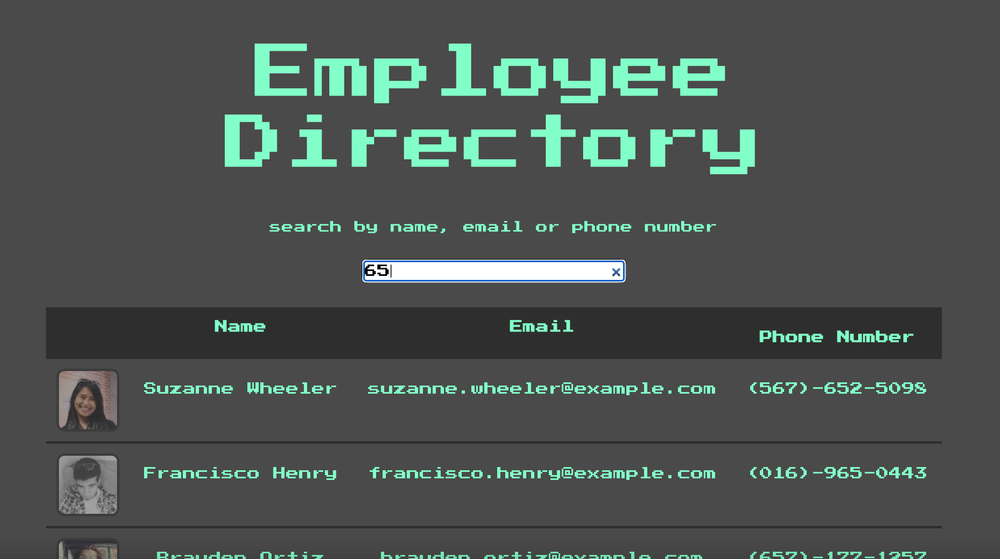
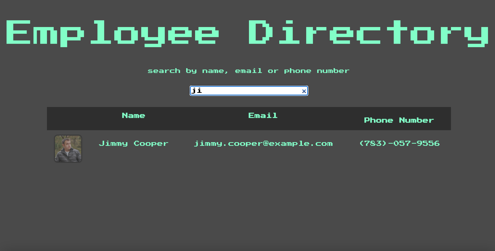
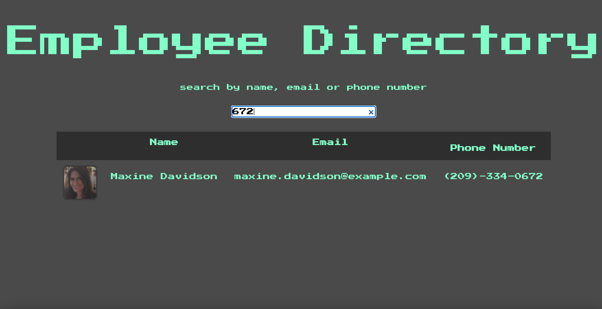
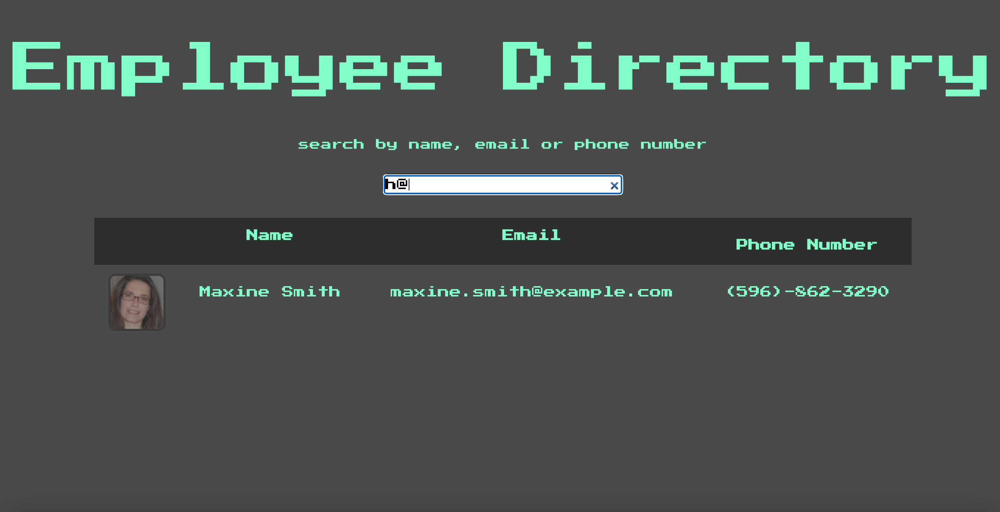

# 19-Employee-Directory

## Live site:

Read Me:
https://github.com/theisen92/19-Employee-Directory

Live Site:
https://theisen92.github.io/19-Employee-Directory/

## Usage

For someone who wants quickly sort through employees at a company by filtering name, email or phone number

## Credits

I primarily used the information from class activities, MDN Developer and Udemy for resources and referenced previous activities.

## Contributing

Used bootstrap for the stying

## Challenges

The main challenge was getting using axios, I decided to use fetch() instead of creating a separate file
Also had trouble pulling the information from the API

## Functionality

Look of the site

Filtering by name

Filtering by number

Filtering by email

